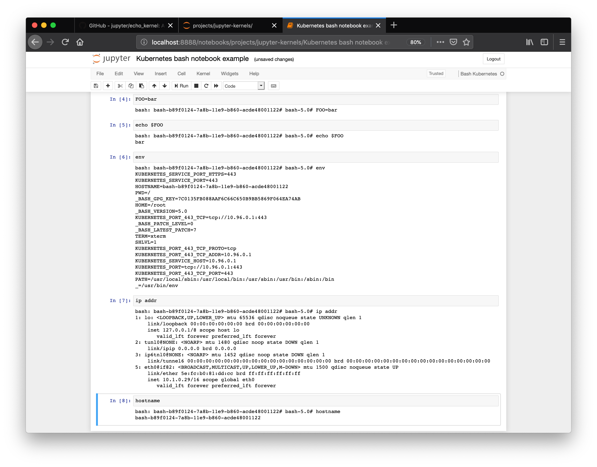
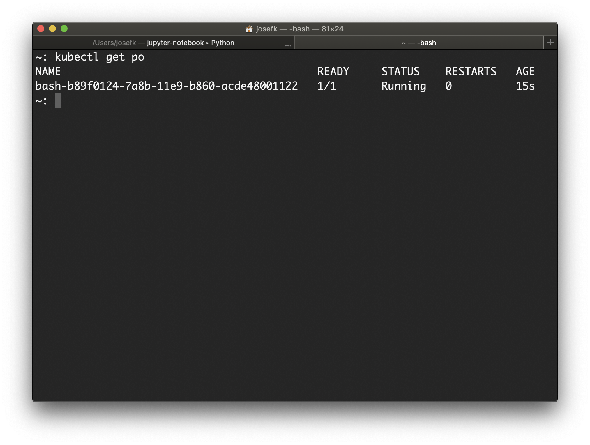

bash_k8s_kernel
=================

``bash_k8s_kernel`` is a simple example of a Jupyter kernel. This repository
complements the documentation on wrapper kernels here:

http://jupyter-client.readthedocs.io/en/latest/wrapperkernels.html

Screenshots
-----------

Installation
------------
To install ``bash_k8s_kernel`` from PyPI::

    python setup.py install
    python -m bash_k8s_kernel.install

Using the Bash kubernetes pod kernel
------------------------------------
**Notebook**: The *New* menu in the notebook should show an option for an Bash kubernetes pod notebook.

**Console frontends**: To use it with the console frontends, add ``--kernel bash_k8s`` to
their command line arguments.
